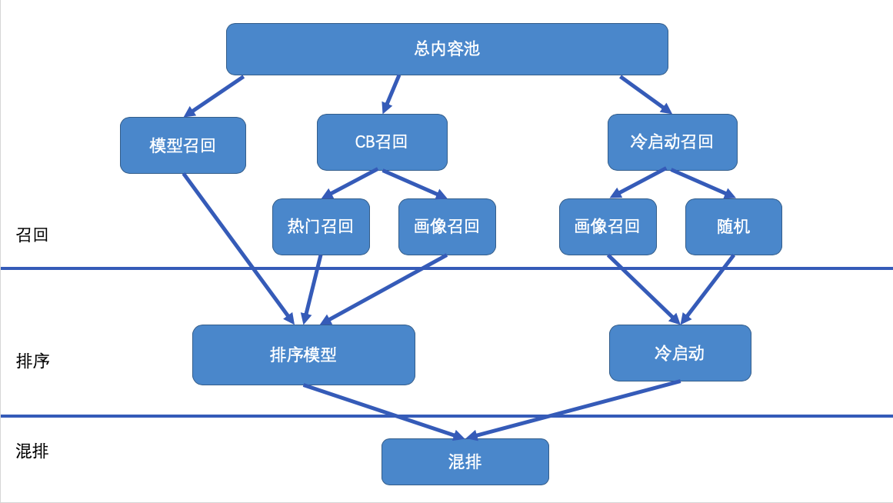

# 推荐系统
## Introduction
RS(Recommendation System) 是一个庞大而复杂的系统。有别于单独的机器学习模型end2end，为了保证线上服务的稳定性，工业界通常会把RS抽象成召回、排序两个大阶段，其下由若干模块组成。各个模块接口设计上是解藕的，但是在某些条件下，各个模块的会相互影响，从而影响整体的效果。想要更清晰地认识每一次实验的因果关系，必须从认识推荐系统的每一个模块开始。

## 推荐系统的整体结构

上图展示了一个简单的RS结构图，分成了召回层、排序层和混排层。  
召回层设计的功能是，从总内容池中粗筛一批内容，减少后续处理数据的量级，主要关注的指标是召回率和效率。  
排序层可以理解为我们经常接触的一些机器学习模型，目的是给候选item精确地打分，最大化业务目标与收益。  
混排层可能是一个模型，也可能是一些策略，在item已有打分的基础上，控制最终展示内容的多样性和先后顺序，目的是更直接地优化用户体验。  
图中每个矩形代表一个逻辑模块，箭头代表数据的流向，数据经过多轮筛选，最终决定出给用户展示的item。

### 召回层
召回层处理的数据量最大，这一层在RS中更注重的是工程的能力，例如系统的响应速度和扩展性。  
CB召回包含了一些策略，例如热门召回，画像召回。通过建立索引，可以迅速地把大概率有不错推荐效果的一批内容挑选出来。  
模型召回可以是协同召回，也可以是各种深度学习模型。常见的落地形式是，经过模型后把item或user向量化。对于变化周期长的特征(例如item的基础特征)，提前计算成向量，对于变化周期短的特征(例如用户点击历史)，向量线上实时计算。向量间的匹配利用Facebook开源的Faiss实现向量的相似度快速检索。  
冷启动召回，选取曝光少于一定阈值的item，通常是最近产生的内容，不经过排序模型，直接展示给用户。冷启动的试探流量能帮助快速累积后验数据，为item给出更准确的推荐。  
从召回覆盖的item数量来看，CB<模型<冷启动。效果上看，模型>CB>冷启动。业务初期，通过简单的统计与策略，CB召回可以很快应用到线上，同时保证相对好的效果，后面模型召回迭代出了效果，可以逐步替换CB召回。从内容供给生态的角度考虑，模型/CB召回和冷启动召回对推荐效果是同样重要的。模型/CB召回把现有的优质内容得到更多曝光，冷启动负责探索新内容，挖掘优质内容。模型/CB召回能短时间内看到效果，冷启动保证模型/CB召回的效果是可持续、不衰减的。  
### 排序层
排序层的任务，实际上包含了1.预估 2.排序两层含义。在排序层，通常我们处理百级别的item，对他们与当前user的匹配程度用模型预估出来一个分数，随后按分数从高到低的顺序展示，也就是[pairwise](https://www.cnblogs.com/txq157/p/6420391.html)的排序方式。模型本身训练效果以外，模型的样本构造、优化目标的设定都是影响线上效果的重要因素。  
冷启动一般不会经过预估的步骤，也就是不经过模型打分，但也会面临排序的问题：一次性召回来多个冷启动item，如何决定最终展示的顺序？对于冷启动的排序，实际上是平衡效率与公平的问题。随机地曝光任一个冷启动item是完全的公平，但也有它的缺点：  
I. 一些新内容(例如与时事热点相关)，在冷启动阶段积累数据消耗了太多时间，等到item能够获得更多曝光的时候，已经失去了推荐价值。  
II. 冷启动中已体现出优质潜质的内容，没有更多短期的曝光支持，打造“爆款”的周期长。  
如果说走排序模型的流量与冷启动流量是一个[EE问题](https://www.jianshu.com/p/95b2de50ce44)，冷启动流量内的流量分配也可以看成一个局部的EE问题。
### 混排层(重排层)
在一些复杂的业务场景，混排层是必不可少的。  
设想在一个内容丰富的推荐场景，既有文章、图片、视频、广告，每个形态的内容还有若干种展示形式，单独依靠排序层的模型，无法优化推荐的多样性。推荐中真实存在的情况是，用户不仅对item内容有喜好，对内容展示的形式也有偏好。即使一个用户很喜欢视频的展示形式，也不能完全给他推荐视频，必须搭配文章图片调节，避免用户审美疲劳。经过召回层与排序层的筛选，输入混排层的item，应该是置信度相对高的优质内容了，本层的优化重点应该在于如何调整这些内容的排列组合，保证推荐的多样性同时提升推荐效果。  
排序层pairwise方式的预估是优化本次推荐，混排层的模型，目光应该看得更长，优化用户在一个session，甚至更长一段时间内的体验。
## 在线离线两条数据通道
待补充。
## 特征与优化目标的选取
在CV/NLP领域，给定一个常规的二分类任务，经过深度模型的学习，通常能取得0.9+的AUC。而在推荐领域，用户的反馈常常是隐式的，特征中还带有噪声，模型学习取得的AUC只能达到0.7-0.9的区间。因此，除了探索先进的模型结构，分析用户行为挖掘特征也会带来很大收益。
### 特征
待完善。

### 优化目标
根据业务需要，推荐系统的优化目标有多种选择。最常见的目标是优化点击率，根据用户曝光/点击的[隐式反馈](https://www.cnblogs.com/hanxuexi/p/11615481.html)，近似认为点击行为表示用户喜欢某一个item。若推荐形态没有点击行为，例如视频，也可以使用播放完成度达到某个值表示用户喜欢某个item。随着业务发展，用户的消费时长、在社区的活跃度、点赞、收藏、分享等行为也需要考虑作为优化的目标。  
标题党
以点击率为优化目标，会天然地遇到标题党的问题(**震惊！！！竟然有人对推荐系统感兴趣！不会吧不会吧！**)。其问题的根源在于，item外层的展示与展开后内容通常是有差距的，标题党外表吸引人点击率更高，但内在内容质量与标题不匹配，导致用户产生了心理落差影响体验。  
另一个常见的优化目标是用户的消费深度，能更真实地反映用户对一个item的喜好程度。标题党的现象在此优化目标下自然会原形毕露，被模型判定为低质内容。但优化消费深度在[内容展示差距] (#btd)的影响下，是一个双刃剑。对于已经点击进入的用户，比优化点击率有更好的效果；但是总的点击率会降低，相比优化点击率的模型，有一些潜在消费用户不会点击了，用户的消费次数会减少。  
单独优化点击或是消费深度，两个目标看起来是矛盾的。能否同时优化多个目标实现共同增长？多目标任务学习给出了解决方案。建模与构造样本时，囊括多个目标，同时探索模型loss与线上预测中每个目标的权重，以此实现比单一目标更好的效果。现阶段比较热门的多目标学习模型/框架有[MMoE](https://blog.csdn.net/ty44111144ty/article/details/99068255), [ESMM](https://zhuanlan.zhihu.com/p/57481330)等。  
## CASE 分析
推荐系统各功能模块相对独立，模块间对接中的参数经常用拍脑袋的方法决定，往往短期内不出现bug，后续便无人维护。当推荐效果/实验结论不符合预期，花大力气排查问题，才会定位到中间的某一个环节。在不断踩坑排雷的过程中积累了一些经验，同时也意识到为推荐链路中间过程添加监控的重要性。下面提供一些案例，给出问题定位、解决方案与监控点添加的思路。
### Case 1.  召回源之间的相互影响
当时观察到的情况是，在排序模型和召回模型没有改动的情况下，在短时间内，有一个召回模型来源的点击率降低，曝光数增加了。  
最直接的想法自然是，分别检查排序模型和召回模型是否出问题了。排查发现两个模型离线训练指标正常，线上服务也正常，看来模型方面没有问题。后来经过多方排查，发现原因是模型召回以外的几个内容召回出问题了，召回数量急剧减少，导致送排序模型的item数减少，且大部分都是模型召回提供的，整体的效果因此变差，与观察到的现象吻合。  
推荐中存在的一个现象是，在总体数据不变的前提下，一个召回源的效果，随着曝光占比的增长，点击率会下降，最终稳定在一个值附近。在本case中，CB召回的数量减少了，排序时模型召回item的占比提升，数据上体现的是模型召回的效果变差，但它不是引起问题的直接原因。  
对于这类问题，最好给每个召回源的召回数量添加监控。
### Case 2. 